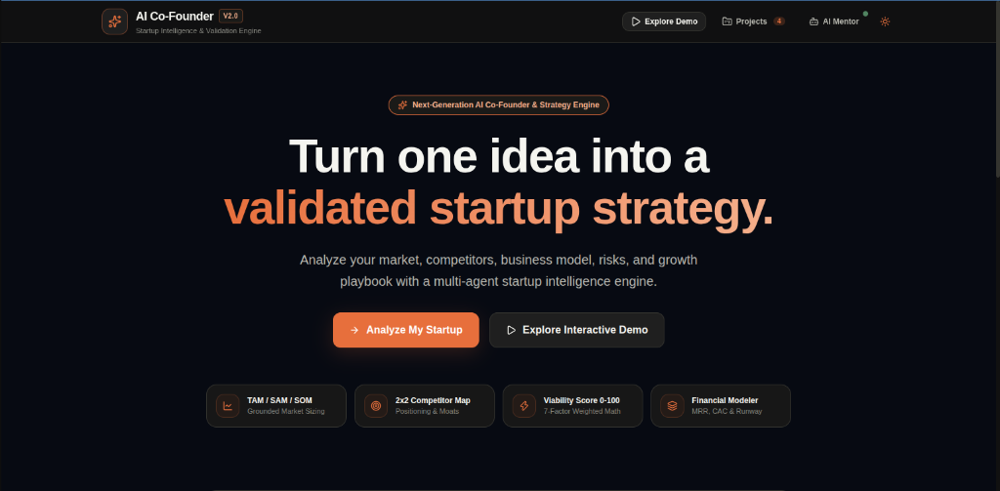
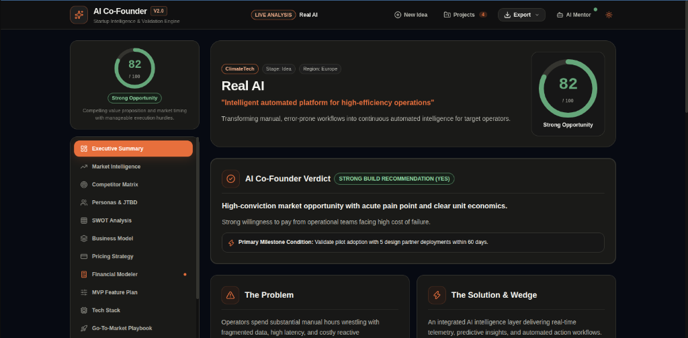
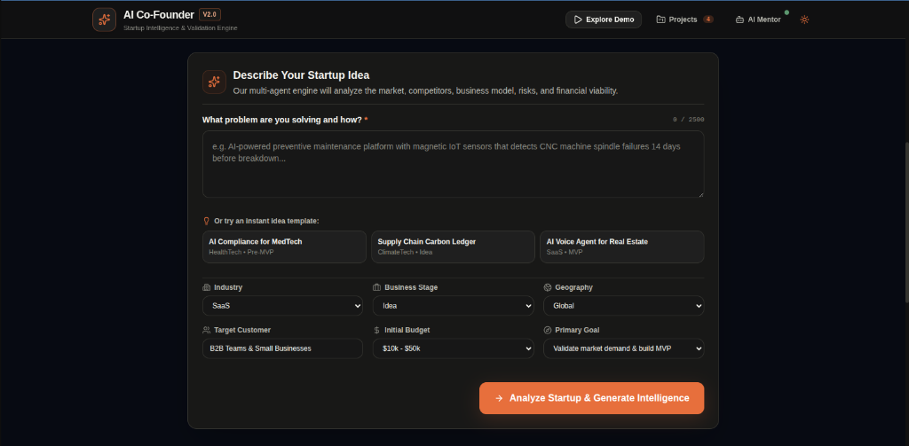
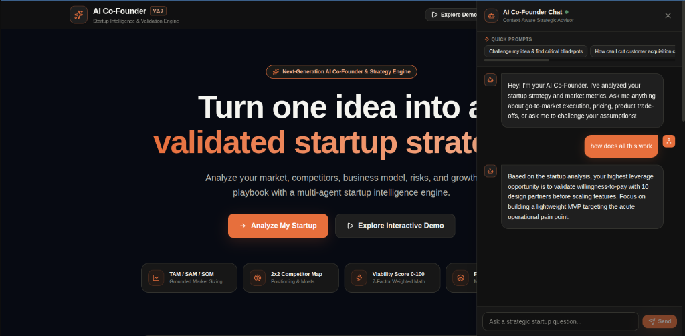
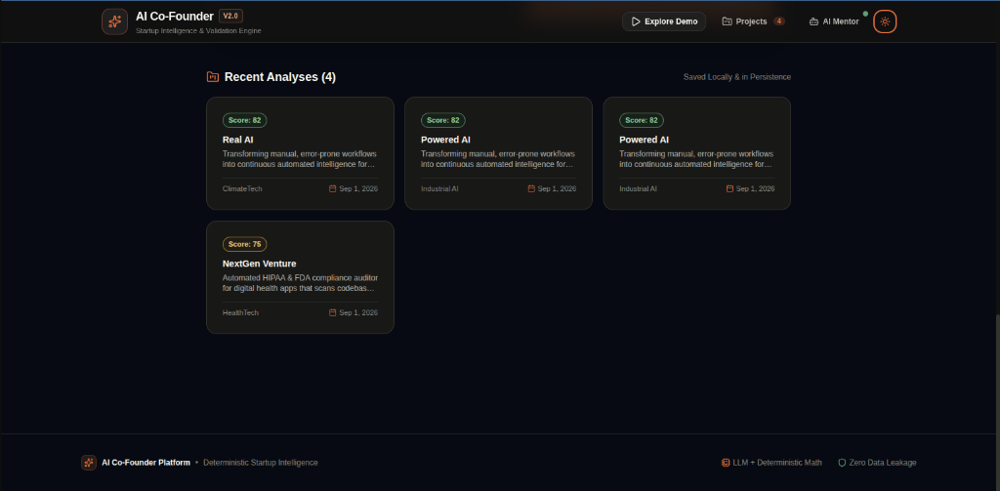
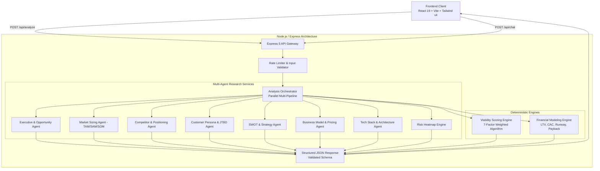

# AI Co-Founder — Next-Generation Startup Intelligence & Validation Engine

<div align="center">


[](https://ai-startup-frontend-one.vercel.app/)
[](https://ai-startup-backend-vduo.onrender.com)

[](https://react.dev)
[](https://vitejs.dev)
[](https://tailwindcss.com)
[](https://nodejs.org)
[](https://expressjs.com)
[](https://github.com/arpitat09/AI_Startup)
[](https://opensource.org/licenses/MIT)

**Turn one startup idea into an investor-grade validation, market intelligence report, financial model, and tactical execution playbook in seconds.**

[🚀 Launch Live Application](https://ai-startup-frontend-one.vercel.app/) • [⚡ Live API Health](https://ai-startup-backend-vduo.onrender.com/health) • [🏗 Architecture](#-system-architecture) • [🧮 Scoring Formula](#-deterministic-7-factor-viability-scoring) • [💻 Local Setup](#-quickstart--installation)

</div>

---

<div align="center">
  
</div>

---

## 🌟 Executive Overview

**AI Co-Founder** is a production-grade startup intelligence and strategic validation platform designed for founders, angel investors, and product architects. 

Most AI tools generate generic, hallucinated advice with zero quantitative grounding. AI Co-Founder solves this by coordinating **multi-agent research pipelines** combined with a **deterministic mathematical scoring engine** and **real-time financial modeling** to produce structured, investor-ready startup dossiers.

### 🎯 Key Value Propositions
- ⏱️ **From Idea to Complete Strategy in < 10 Seconds** (TAM/SAM/SOM, 2x2 Competitor Map, SWOT, ICP Personas, 12-Slide Pitch Deck).
- 🧮 **Deterministic Viability Scoring (0–100)** computed via weighted mathematical algorithms — eliminate subjective AI hallucinations.
- 💼 **Interactive 12-Month Financial Engine** with live recalculation of MRR, ARR, CAC payback, LTV/CAC ratios, and runway burn.
- 🎨 **Executive Charcoal + Burnt Orange Design System** engineered for clarity, high contrast, and focus.

---

## 📸 Product Walkthrough & Key Features

### 1. Executive Intelligence & Viability Score (0–100)
<div align="center">
  
</div>

- **AI Co-Founder Verdict**: Strategic Go/No-Go build recommendation with required milestone conditions.
- **Problem & Solution Wedge**: Identifies acute founder wedges and value moats against legacy incumbents.
- **7-Factor Score Ring**: Animated score ring visualizing startup viability with granular subscore breakdown.

---

### 2. Multi-Parameter Startup Input Terminal
<div align="center">
  
</div>

- **Custom Parameter Inputs**: Industry, target customer segment, geography (North America, Europe, APAC, Global), stage, and budget constraints.
- **1-Click Idea Templates**: Instant presets for B2B SaaS, HealthTech compliance, ClimateTech carbon ledgers, and AI voice agents.

---

### 3. Context-Aware AI Co-Founder Strategic Chat
<div align="center">
  
</div>

- **Real-Time Strategic Advisory**: Grounded in your specific startup's generated intelligence report.
- **Challenge Mode**: Actively pressure-tests assumptions, finds blindspots, and optimizes customer acquisition strategies.
- **Quick Prompts**: 1-click strategic inquiries for pricing, CAC reduction, MVP scoping, and competitor defenses.

---

### 4. Saved Projects & Portfolio History
<div align="center">
  
</div>

- **Local & Backend Persistence**: Seamlessly save, review, and switch between multiple startup analyses.
- **1-Click Export**: Download complete 12-slide pitch decks or full strategic reports as formatted Markdown (`.md`) or PDF.

---

## ⚡ Core Feature Modules

```
├── 📊 Executive Summary           → AI Verdict, Strategic Wedge, Core Problem/Solution
├── 📈 Market Intelligence         → Grounded TAM / SAM / SOM Sizing, CAGR, Market Drivers
├── 🥊 Competitor Matrix           → 2x2 Positioning Map, Competitor Strengths & Vulnerabilities
├── 🧭 Customer Personas & JTBD    → Acute Pain Points, Buying Triggers, Friction Stages
├── 🛡️ SWOT Analysis               → 4-Quadrant Strategic Breakdown with Actionable Takeaways
├── 🏛️ Business Model Canvas       → Osterwalder 9 Building Blocks & Cost/Revenue Structures
├── 💎 Pricing Tiers               → 3-Tier SaaS Monetization Architecture & Target Segmenting
├── 🧮 Interactive Financials      → Real-time sliders for MRR, ARR, LTV/CAC, Payback, Runway
├── 🚀 MVP Feature Scope (MoSCoW)  → Must-Have, Should-Have, Nice-To-Have & 30-Day Sprint Plan
├── ⚙️ Tech Architecture           → Recommended Stacks, Cloud Infrastructure, Cost Estimates
├── 📣 Go-To-Market Playbook       → First 10 Customers Guide & 0-to-100 Scaled Channel Mix
├── ⚠️ 7-Dimension Risk Matrix     → Heatmap (Market, Tech, Regulatory, Team) with Mitigations
├── 📅 30/60/90 Day Roadmap        → Interactive Milestone Checklist with Task Progress
└── 💼 12-Slide Pitch Deck         → Investor Narrative, Traction Metrics & Speaker Notes
```

---

## 🏗 System Architecture



---

## 🧮 Deterministic 7-Factor Viability Scoring

Unlike standard LLM chatbots that make up arbitrary numbers, AI Co-Founder uses a **deterministic mathematical scoring engine**:

$$\text{Overall Score} = \sum_{i=1}^{7} (S_i \times W_i)$$

| Factor ($i$) | Weight ($W_i$) | Evaluation Criteria |
|---|:---:|---|
| **Market Potential** | `20%` | Addressable market size, growth velocity (CAGR), and tailwinds. |
| **Problem Strength** | `15%` | Severity of customer pain, frequency, and willingness to pay. |
| **Competitive Advantage**| `15%` | Defensibility, moats, switching costs, and uniqueness against incumbents. |
| **Business Model Viability** | `15%` | Margin profile, recurring revenue predictability, and expansion revenue. |
| **Differentiation Factor** | `15%` | Proprietary workflows, specialized AI models, or unique distribution wedges. |
| **Execution Feasibility** | `10%` | Technical complexity, time-to-MVP, and initial capital requirements. |
| **Risk Resilience** | `10%` | Regulatory exposure, platform dependency, and churn vulnerability. |

---

## 🛠 Tech Stack

### Frontend
- **Framework**: React 19 (Hooks, Context API, Suspense)
- **Bundler & Tooling**: Vite 6.0
- **Styling**: Tailwind CSS v4 + PostCSS with Custom Charcoal + Burnt Orange Design Tokens
- **Icons**: Lucide React
- **Hosting**: Vercel (Global Edge Network)

### Backend
- **Runtime**: Node.js (v18+)
- **Web Framework**: Express 5.0 (ES Modules)
- **Security & Protection**: Express Rate Limiting, CORS, Input Sanitation
- **AI / LLM Orchestration**: Google Gemini 1.5 Flash (`@google/generative-ai`), Groq Cloud LLaMA 3.3 (`groq-sdk`), and Contextual Offline Intelligence Engine
- **Hosting**: Render (Cloud Web Service)

---

## 💻 Quickstart & Installation

### 1. Clone the Repository
```bash
git clone https://github.com/arpitat09/AI_Startup.git
cd AI_Startup
```

### 2. Backend Setup
```bash
cd backend
npm install

# Copy example environment variables
cp .env.example .env

# (Optional) Add your free Gemini or Groq API Key to .env
# GEMINI_API_KEY=AIzaSy...

# Start backend server (runs on http://localhost:3001)
npm run dev
```

### 3. Frontend Setup
```bash
# In a new terminal window
cd frontend
npm install

# Copy example environment variables
cp .env.example .env

# Start frontend development server (runs on http://localhost:5173)
npm run dev
```

---

## 🧪 Testing Suite

Run backend test suite verifying the viability scoring algorithm, financial calculations, and JSON parsing pipelines:

```bash
npm test --prefix backend
```

Run frontend code quality linting:

```bash
npm run lint --prefix frontend
```

---

## 📡 API Reference

### `POST /api/analyze`
Generates full startup intelligence report across all 13 modules.

**Request Body:**
```json
{
  "idea": "AI-powered predictive maintenance for manufacturing plants.",
  "industry": "Manufacturing",
  "targetCustomer": "Plant Operations Directors",
  "geography": "North America & Europe",
  "stage": "Pre-MVP",
  "budget": "$25k - $50k"
}
```

**Response:**
```json
{
  "success": true,
  "data": {
    "meta": { "startupName": "PulseMach AI", "industry": "Manufacturing" },
    "score": { "overallScore": 84, "tier": "Strong Opportunity" },
    "executive": { ... },
    "market": { "tam": "$42.5B", "sam": "$8.2B", "som": "$450M" },
    "competitors": { ... },
    "financials": { ... },
    "pitch": { ... }
  }
}
```

### `GET /health`
Returns live service status and uptime:
```json
{
  "status": "ok",
  "service": "AI Co-Founder API",
  "version": "2.0.0",
  "uptime": 1420
}
```

---

## 📜 License

This project is open-source and licensed under the [MIT License](LICENSE).

---

<div align="center">
  <sub>Built with precision by <strong>Arpita</strong> • Designed for Founders & Innovators Worldwide</sub>
</div>
