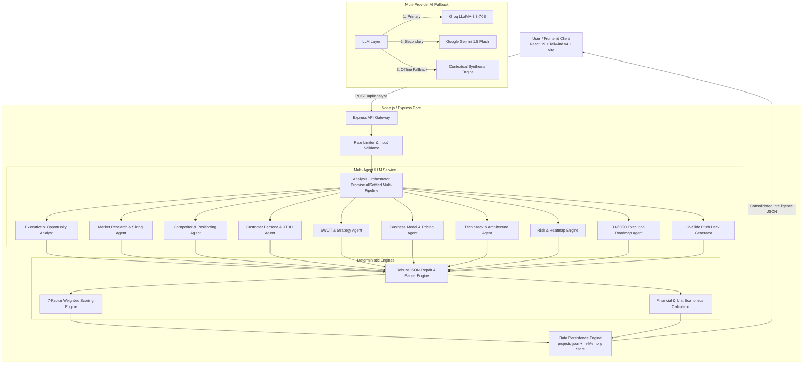

# AI Co-Founder — Next-Generation Startup Intelligence Engine

<div align="center">


[](https://react.dev)
[](https://vitejs.dev)
[](https://tailwindcss.com)
[](https://nodejs.org)
[](https://expressjs.com)
[](https://github.com/arpitat09/AI_Startup)
[](https://opensource.org/licenses/MIT)

**Turn one startup idea into an investor-grade validation, market intelligence report, financial model, and tactical execution playbook in seconds.**

[Live Demo](#-interactive-demo-mode) • [Architecture](#-system-architecture) • [Scoring Engine](#-deterministic-7-factor-scoring-engine) • [API Docs](#-api-reference) • [Quickstart](#-quickstart--installation)

</div>

---

## 🌟 Overview

**AI Co-Founder** is an enterprise-grade AI intelligence platform designed for founders, venture analysts, and product builders. Rather than relying on simple unstructured LLM chat, AI Co-Founder coordinates **multi-agent research pipelines** combined with **deterministic mathematical algorithms** to deliver rigorous startup viability assessments.

### Key Capabilities

- 🎯 **Grounded Market Sizing (TAM / SAM / SOM)** with methodology explanations, geography filtering, and confidence metrics.
- 🥊 **2x2 Competitor Positioning Matrix** with threat tiers, strengths, weaknesses, and defensibility moats.
- 🧭 **Customer Personas & JTBD (Jobs-To-Be-Done)** with acute pain points, buying triggers, and friction mapping.
- 📊 **Osterwalder 9-Box Business Model Canvas** & Tiered SaaS Monetization Architecture.
- 🧮 **Interactive Real-Time Financial Modeler** computing MRR, ARR, LTV, CAC, LTV/CAC ratios, payback periods, and 12-month projections.
- ⚖️ **Deterministic 7-Factor Startup Viability Score (0–100)** with zero LLM hallucination on final aggregate scores.
- 🛡️ **7-Dimension Risk Heatmap & Mitigation Matrix** (Market, Execution, Tech, Financial, Regulatory, Retention, Team).
- 📅 **MVP Feature Planner (MoSCoW)** and **30 / 60 / 90 Day Tactical Execution Roadmap**.
- 💼 **12-Slide Investor Pitch Deck** with pitch narrative, metrics, and presenter speaker notes.
- 🤖 **Context-Aware AI Co-Founder Chat** for real-time strategic advisory and objection handling.
- 💾 **Local & Backend Project Persistence** with Instant PDF and Markdown Export.

---

## 🏗 System Architecture



---

## 🧠 Deterministic 7-Factor Scoring Engine

To prevent generative models from hallucinating arbitrary scores, **AI Co-Founder decouples structured factor evaluation from aggregate score calculation**. The AI evaluates 7 fundamental criteria on a 0–100 scale, and our deterministic mathematical engine calculates the final score and assigns the viability tier:

$$\text{Viability Score} = \sum_{i=1}^{7} (W_i \times S_i)$$

| Factor | Weight ($W_i$) | Description |
| :--- | :---: | :--- |
| **Market Potential** | `20%` | Total addressable spend, CAGR, structural tailwinds, and macro trends. |
| **Problem Strength** | `15%` | Severity of customer pain, frequency of occurrence, and willingness to pay. |
| **Competition Advantage** | `15%` | Defensibility against incumbents, feature moats, and ease of replication. |
| **Business Model Viability**| `15%` | Unit economics, gross margins, recurring revenue feasibility, and CAC payback. |
| **Differentiation Factor** | `15%` | 10x value wedge, positioning uniqueness, and asymmetric distribution advantage. |
| **Execution Feasibility** | `10%` | Technical complexity, time-to-MVP, required infrastructure, and resource barriers. |
| **Risk Resilience** | `10%` | Severity score across regulatory, technological, retention, and market risks. |

### Viability Tiers

- 🟢 **90 – 100:** *Exceptional Opportunity* — Outstanding fundamentals, acute market pain, and strong moat.
- 🔵 **75 – 89:** *Strong Opportunity* — High viability with clear execution path; address minor unit economic risks.
- 🟡 **60 – 74:** *Promising (Needs Refinement)* — Viable core concept but requires positioning tightening or CAC reduction.
- 🟠 **40 – 59:** *Needs Significant Validation* — High friction or intense competition; validate willingness-to-pay first.
- 🔴 **0 – 39:** *High Risk (Pivoting Recommended)* — Extreme headwinds, low moat, or prohibitive acquisition costs.

---

## 🧮 Financial & Unit Economics Engine

The interactive Financial Modeler uses deterministic client-side and server-side formulas:

- **Monthly Recurring Revenue (MRR):** $\text{Customers} \times \text{Average Revenue Per User (ARPU)}$
- **Annual Recurring Revenue (ARR):** $\text{MRR} \times 12$
- **Customer Lifetime Value (LTV):** $\frac{\text{ARPU} \times \text{Gross Margin \%}}{\text{Monthly Churn \%}}$
- **LTV to CAC Ratio:** $\frac{\text{LTV}}{\text{CAC}}$ *(Target: $\ge 3.0\times$)*
- **CAC Payback Period:** $\frac{\text{CAC}}{\text{ARPU} \times \text{Gross Margin \%}}$ *(Target: $< 12\text{ months}$)*
- **Break-Even Customer Threshold:** $\frac{\text{Monthly Fixed Burn}}{\text{ARPU} \times \text{Gross Margin \%}}$
- **Runway (Months):** $\frac{\text{Cash Reserves}}{\max(1, \text{Monthly Burn} - \text{Gross Profit})}$

---

## 🚀 Quickstart & Installation

### Prerequisites

- **Node.js**: v18.0.0 or higher
- **npm**: v9.0.0 or higher

### 1. Clone the Repository

```bash
git clone https://github.com/arpitat09/AI_Startup.git
cd AI_Startup
```

### 2. Backend Setup

```bash
cd backend
npm install
cp .env.example .env
```

Configure your `.env` file with optional AI API keys (Groq or Gemini):

```env
PORT=3001
AI_PROVIDER=groq
GROQ_API_KEY=your_groq_api_key_here
GEMINI_API_KEY=your_gemini_api_key_here
```

> **Note:** If no API keys are provided, the backend seamlessly activates its **Contextual Offline Synthesis Engine**, ensuring 100% functionality without crashes or 500 errors.

Start the backend:
```bash
npm start
# or for hot-reloading development:
npm run dev
```

Run backend unit test suite:
```bash
npm test
```

### 3. Frontend Setup

In a new terminal window:

```bash
cd frontend
npm install
npm run dev
```

Open [http://localhost:5173](http://localhost:5173) in your browser to experience the platform.

---

## 🎮 Interactive Demo Mode

Want to explore the platform without typing an idea or configuring keys? Click **"Explore Interactive Demo"** on the home screen or navbar.

The demo mode loads a full analysis for:
> **"AI-Powered Preventive Maintenance Platform for Small & Mid-Sized Manufacturing"**

---

## 📡 API Reference

### Health Check
```http
GET /health
```
**Response:**
```json
{
  "status": "healthy",
  "version": "2.0.0",
  "uptime": 142.5,
  "timestamp": "2026-09-01T22:00:00.000Z",
  "aiProvider": "groq",
  "hasGroqKey": true,
  "hasGeminiKey": false
}
```

### Run Startup Analysis
```http
POST /api/analyze
Content-Type: application/json
```
**Request Body:**
```json
{
  "idea": "AI-powered automated HIPAA & FDA compliance auditor for digital health apps...",
  "industry": "HealthTech",
  "targetCustomer": "Digital health startups and clinics",
  "geography": "US",
  "stage": "Pre-MVP",
  "budget": "$10k - $50k",
  "goal": "Validate market demand & build MVP"
}
```

### AI Co-Founder Chat
```http
POST /api/chat
Content-Type: application/json
```
**Request Body:**
```json
{
  "message": "What is our strongest moat against incumbents?",
  "startupIdea": "AI preventive maintenance platform...",
  "context": {
    "startupName": "PredictiPulse AI",
    "industry": "Industrial AI"
  }
}
```

### Project Management
- `GET /api/projects` — List all saved startup reports
- `GET /api/projects/:id` — Fetch specific report by ID
- `DELETE /api/projects/:id` — Delete saved report

---

## 🛠 Tech Stack

### Frontend
- **Framework:** React 19 + Vite 6
- **Styling:** Tailwind CSS v4 + Custom Glassmorphism Theme System
- **State Management:** React Context (`ProjectContext`, `ThemeContext`)
- **Icons:** Lucide React
- **Exporting:** jsPDF, Markdown synthesis utilities

### Backend
- **Runtime:** Node.js + Express
- **Security:** Rate limiting (`express-rate-limit`), CORS, input sanitization
- **AI Integrations:** Groq SDK (`llama-3.3-70b-versatile`), Google Generative AI (`gemini-1.5-flash`)
- **Math Engines:** Deterministic scoring, compound growth financial calculator
- **Persistence:** Local JSON document store + in-memory index

---

## 🧪 Testing & Code Quality

```bash
# Run backend unit tests (Scoring, Financials, JSON Parser)
npm test --prefix backend

# Run frontend ESLint
npm run lint --prefix frontend

# Build frontend production bundle
npm run build --prefix frontend
```

---

## 📄 License

This project is licensed under the MIT License — see the [LICENSE](LICENSE) file for details.
